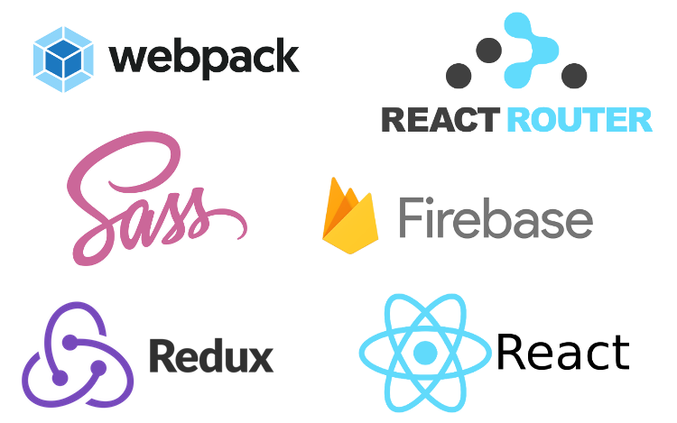
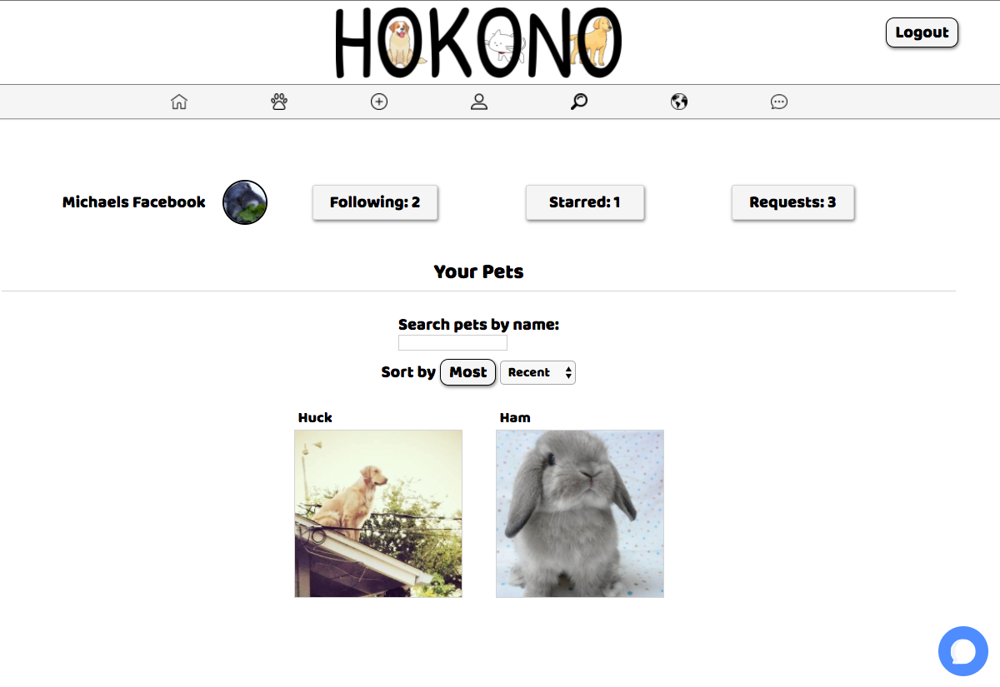

# Hokono 

Live version [here](https://hokono-90da1.firebaseapp.com/)

> A place for pets
  > - Explore and follow pets from around the world
  > - Document your own pet's life
  > - Adopt from nearby shelters

## Live Demo

A stable version of the Hokono web client is deployed [here](https://hokono-90da1.firebaseapp.com).

## Mobile

For the Hokono moblie client, please see the dedicated mobile repo [here](https://github.com/hokonoDev/ionic-hokono).

## Team

  - __Development Team Members__:
  	- __Alec Draymore__ - Fullstack Engineer
  	- __Michael Lam__ - Fullstack Engineer
  	- __Wei Chen__ - Fullstack Engineer

## Table of Contents

1. [Usage](#Usage)
1. [Requirements](#requirements)
1. [Development](#development)
    1. [Installing Dependencies](#installing-dependencies)
    1. [Tasks](#tasks)
1. [Team](#team)
1. [Contributing](#contributing)

## Usage

Run ```npm install``` to install all node modules.

Run ```npm start``` to start the app.

## Tech

### Requirements

- Node 0.10.x
- NPM

### Tech Stack



## Development

### Installing Dependencies

From within the root directory:

```sh
npm install
```

### Roadmap

View the project roadmap [here](https://github.com/hokonoDev/hokono/issues)


## Contributing

See  for contribution guidelines.

## Screenshot


